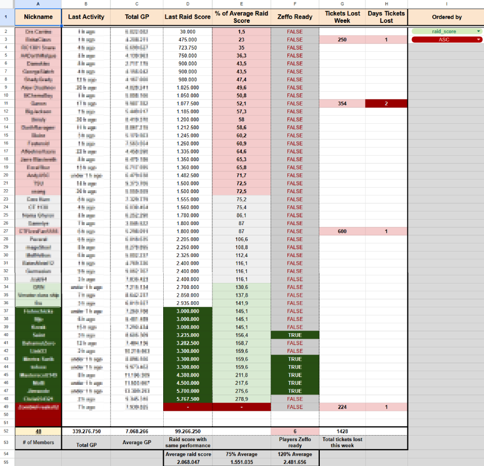

# SWGOH Guild Data

A project to gather, process, and manage data from the game **Star Wars: Galaxy of Heroes (SWGOH)** for guild management and spreadsheet reporting.

## Features

- **Automated Data Collection:** Fetches player, guild, and raid data via API requests, as well as .csv imports.
- **Database Integration:** Reads from and writes to a PostgreSQL database for persistent storage.
- **Containerization:** Runs in a docker container with dependencies managed through UV and environment variables imported at run-time. 
- **Spreadsheet Sync:** Updates Google Sheets with the latest guild and player statistics.
- **Logging & Error Handling:** Configurable logging for debugging and monitoring.
- **Roster & Ticket Tracking:** Tracks player activity, raid scores, tickets, and roster requirements for the Rise of the Empire TB. That includes readiness for the special mission to unlock Zeffo, Mandalore and the special mission to aquire Reva shards.
- **Data Archiving:** Archives players who have left the guild and removes them from the active members tables.

## Project Structure

```
.
├── src/                  # Main application source code
│   ├── api_request.py
│   ├── archive_players.py
│   ├── check_raid_results.py
│   ├── csv_import.py
│   ├── enter_data.py
│   ├── helper_functions.py
│   ├── log_gp.py
│   ├── log_raid_score.py
│   ├── log_tickets.py
│   ├── manage_members.py
│   ├── push_to_sheets.py
│   ├── read_data.py
│   ├── remove_data.py
│   ├── roster_checks.py
│   ├── spreadsheet_operations.py
│   ├── update_data.py
│   └── ...
├── scripts/              # Scripts that are run through the container crontab & entrypoint script
│   ├── entrypoint.sh
│   ├── run_check_raid_results.sh
│   ├── run_log_gp.sh
│   ├── run_log_raid_score.sh
│   ├── run_manage_members.sh
│   ├── run_push_to_sheets.sh
│   ├── run_roster_checks.sh
├── tests/                # Unit tests
├── README.md             # This file
```
## Data Sources & Dependencies

This project uses a PostgreSQL database for persistent storage and easy access to prepared views to display on google spreadsheets. Most of the data is fetched automatically through a locally hosted version of the [swgoh-comlink](https://github.com/swgoh-utils/swgoh-comlink) API, which serves mostly publicly available game data. <br>
To ensure accuracy, ticket data is retrieved within a few minutes of the guild reset every day. TB data has to be manually exported from other tools like HotUtils and can then be imported to the database.<br>
The database, API and scheduled python programs are hosted on local hardware. 

## Spreadsheet View Example



The main view combines the most important metrics, so they are visible at a glance. For a deeper dive into the different topics, there are more detailed views available. <br>
(Information that could potentially identify an individual has been anonymized for this example.)

## Reproducing the project

This is meant solely as a personal project at this point. I will not actively support replication efforts, but you are welcome to ask questions.
Please open an issue, if you have any inquiries. 


---

*This project is not affiliated with or endorsed by Electronic Arts Inc. or Lucasfilm Ltd. All trademarks are property of their respective owners.*
